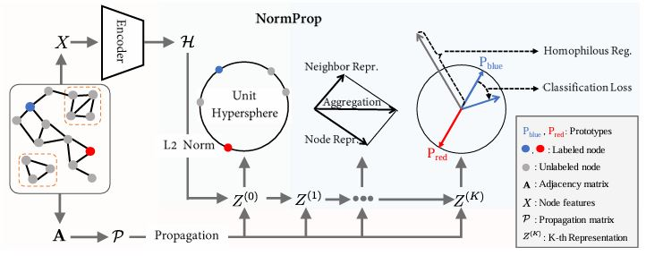

# NormProp (AAAI-2025)

PyTorch Code for the following paper at AAAI-2025:

Title: Normalize Then Propagate: Efficient Homophilous Regularization for Few-shot Semi-Supervised Node Classification

AAAI-25:    https://ojs.aaai.org/index.php/AAAI/article/view/33437

ArXiv:    https://arxiv.org/abs/2501.08581

Keywords: graph neural networks, semi-supervised node classification


### Abstract
> Graph Neural Networks (GNNs) have demonstrated remarkable ability in semi-supervised node classification.
However, most existing GNNs rely heavily on a large amount of labeled data for training, which is labor-intensive and requires extensive domain knowledge.
In this paper, we first analyze the restrictions of GNNs generalization from the perspective of supervision signals in the context of few-shot semi-supervised node classification.
To address these challenges, we propose a novel algorithm named NormProp, which utilizes the homophily assumption of unlabeled nodes to generate additional supervision signals, thereby enhancing the generalization against label scarcity.
The key idea is to efficiently capture both the class information and the consistency of aggregation during message passing, via decoupling the direction and Euclidean norm of node representations.
Moreover, we conduct a theoretical analysis to determine the upper bound of Euclidean norm, and then propose homophilous regularization to constraint the consistency of unlabeled nodes.
Extensive experiments demonstrate that NormProp achieve state-of-the-art performance under low-label rate scenarios with low computational complexity.




### Requirements
- python >= 3.8
- numpy >= 1.24
- pytorch >= 2.0
- torch_geometric >= 2.0


### Running NormProp
The predefined prototypes are generated by Hyperspherical Prototype Networks https://github.com/psmmettes/hpn

We have pre-generated some prototypes and saved them. You can run NormProp directly using the following command.
```sh
# cora
python main.py  --dataset cora --weight-decay 0.01 --nhid 8 --lr 0.01 --dropout 0.3 --mu 1.3 --warmup 5 --conf-threshold 0.8 --epochs 200

# citeseer
python main.py  --dataset citeseer --weight-decay 0.01 --nhid 8 --lr 0.01 --dropout 0.4 --mu 0.7 --warmup 10 --conf-threshold 0.8 --epochs 150

# pubmed
python main.py  --dataset pubmed --weight-decay 0.01 --nhid 8 --lr 0.01 --dropout 0.4 --mu 0.8 --warmup 10 --conf-threshold 0.98 --epochs 150
```

### Cite NormProp
Please cite the paper accordingly:
```
@article{zhang2025normprop, 
	title={Normalize Then Propagate: Efficient Homophilous Regularization for Few-Shot Semi-Supervised Node Classification},
	author={Zhang, Baoming and Chen, MingCai and Song, Jianqing and Li, Shuangjie and Zhang, Jie and Wang, Chongjun},
	journal={Proceedings of the AAAI Conference on Artificial Intelligence},
	year={2025},
	volume={39},
	number={12},
	pages={13170-13178}
	url={https://ojs.aaai.org/index.php/AAAI/article/view/33437},
	DOI={10.1609/aaai.v39i12.33437},
}
```


